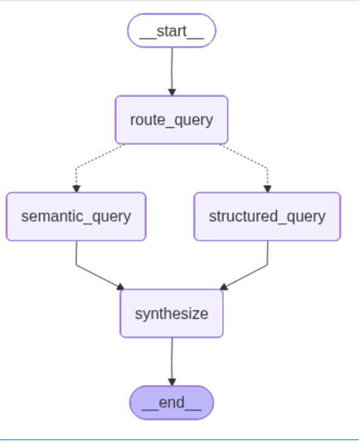

# IMDB Conversational Agent

A LangGraph-powered conversational agent for querying the IMDB Top 1000 dataset using **DuckDB** (structured queries) and **ChromaDB** (semantic search).

## Architecture




**3 Query Types:**
- **STRUCTURED**: SQL-based filtering/sorting (e.g., "Top 5 movies of 2019")
- **SEMANTIC**: Theme-based search (e.g., "Movies with police involvement")  
- **HYBRID**: Both (e.g., "Comedy movies with death themes")

## Quick Start

### 1. Install Dependencies
```bash
uv sync
# OR: pip install -e .
```

### 2. Configure Environment
```bash
cp env.example .env
# Add your OPENAI_API_KEY to .env
```

### 3. Setup Data (one-time, ~2-3 minutes)
```bash
python -m src.data_setup
```

### 4. Run
**Streamlit UI:**
```bash
streamlit run src/app.py
```

**Telegram Bot:**
```bash
python -m src.telegram_bot
```

**Test Suite:**
```bash
python -m src.test_queries
```

## Project Structure

```
realpage-imdb/
├── src/
│   ├── config.py          # Environment & configuration
│   ├── data_setup.py      # CSV → DuckDB + ChromaDB setup
│   ├── tools.py           # DuckDB and ChromaDB wrappers
│   ├── prompts.py         # All LLM prompt templates
│   ├── agents.py          # 4 agents + LangGraph workflow
│   ├── app.py             # Streamlit UI
│   ├── telegram_bot.py    # Telegram integration
│   └── test_queries.py    # Test suite
├── data/
│   ├── imdb_top_1000.csv  # Source data
│   └── imdb.duckdb        # DuckDB database (created by setup)
├── vectorstore/chroma/    # ChromaDB store (created by setup)
└── notebooks/
    └── prompt_testing.ipynb # Prompt experimentation
```

## Example Queries

**Structured:**
- "When did The Matrix release?"
- "Top 5 movies of 2019 by meta score"
- "Directors with movies grossing over $500M at least twice"

**Semantic:**
- "Movies with police involvement in the plot"
- "Films about redemption"

**Hybrid:**
- "Comedy movies with death themes"
- "Steven Spielberg sci-fi movies - summarize plots"
- "Movies before 1990 with police involvement"

## Technologies

- **LangGraph**: Multi-agent workflow orchestration
- **DuckDB**: Embedded SQL database for structured queries
- **ChromaDB**: Vector database for semantic search
- **OpenAI**: LLM (GPT-4o-mini) + embeddings
- **Streamlit**: Web UI
- **python-telegram-bot**: Telegram integration
- **LangSmith** (optional): Monitoring and tracing

## Documentation

- **[CODE_REFERENCE.md](CODE_REFERENCE.md)**: Detailed explanation of each file and function
- **Source code**: All files have inline documentation

## Assignment Requirements

This project fulfills the RealPage take-home assignment requirements:
- Conversational agent using OpenAI API
- Queries IMDB dataset
- Handles all 9 test questions (structured + semantic)
- Streamlit UI
- Can run locally
- Vector store for semantic search
- Instructions to run

## Troubleshooting

**"Database not found"**: Run `python -m src.data_setup`

**"OPENAI_API_KEY not set"**: Check your `.env` file

**Module import errors**: Ensure you're running commands from the `realpage-imdb/` directory

## License

Educational/Interview project

---

**Built with LangGraph + DuckDB + ChromaDB**
